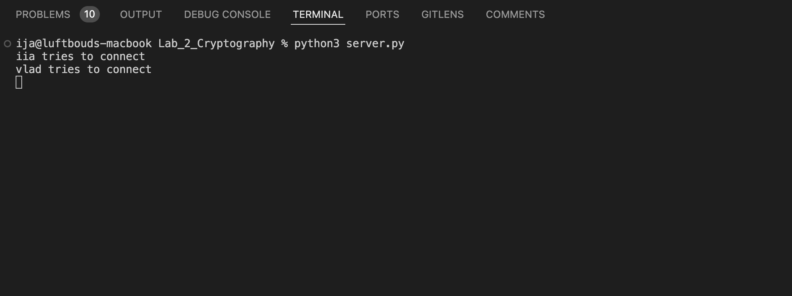
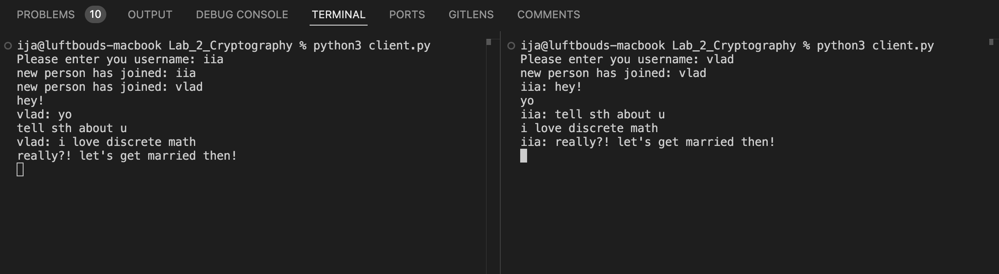

# Discrete Mathematics Lab Work #2  
> Created with love ❤️ by Władysław Danyłyshyn and Iia Maharyta  

---

### 🛠️ The Task  
Our task was to build a simple messenger in which every message is encrypted to ensure security.  
And yes—we made it happen 🎉

---

### 🔍 How It Works

#### Files  
**`utils.py`** — contains helper functions.

```python
miller_rabin(n: int)
```
* This function checks whether a number is prime using the Miller-Rabin primality test. It is used for key generation on both the server and the client sides.

```python
get_key()
```
* A simple function that generates a large prime number (using the previous function) within the range [`10^100`, `10^101`].

```python
generate_key(phi: int)
```
* Generates a public key by finding a number that is coprime with φ.

---

### 📁 Main Files — `server.py` and `client.py`

When both files are launched, functions are called to establish a connection between the client and the server and to generate encryption keys.

Each of the files initializes the following main variables:

- `self.mod` — the public key modulus, which is the product of two large prime numbers generated using `get_key()`.
- `phi` — similar to the modulus, but each number used was reduced by one.
- `self.encrypt_key` or `encrypt_key` — the public key used for encrypting messages. It is generated with `generate_key(phi)`.
- `self.decrypt_key` — the private key used for decrypting messages. It is essentially the modular inverse of the public key.

---

### 🧠 Program Flow

1. Once keys are generated, public keys are exchanged between the server and the clients.  
2. The server listens for messages from clients.  
3. When a user sends a message, the client first encodes it: the text is converted into a string of numbers based on the UNICODE table, and then encrypted using the public key received from the server.  
4. Encryption and decryption are done using the following logic:  
   ```python
   pow(data, key, mod)
   ```  
   The key used depends on the direction of the message (encryption vs decryption).  
5. The server receives the encrypted message, decrypts it using its private key, then re-encrypts it using each recipient's public key (excluding the sender), and sends it out.  
   On the client side, users decrypt the messages using their own private keys.  

---

Additionally, we implemented a `broadcast` function that allows sending messages to **all** connected clients and an ability to quit the conversation (the user has to type 'q').

---
### #️⃣ Hash

Hash is calculated and sent together with a message (but as a separate instance). When the client gets the message - it calculates the hash out of it and compares with the recieved hash. If they are not the same - an error is raised.

---

### 🖼️ Demo

#### Server-side:


---

#### Client-side:


---

Thank you for your attention!  
🎥 [Video Presentation](https://youtu.be/dQw4w9WgXcQ?si=3-DuVI1cb-8Mon_X)
